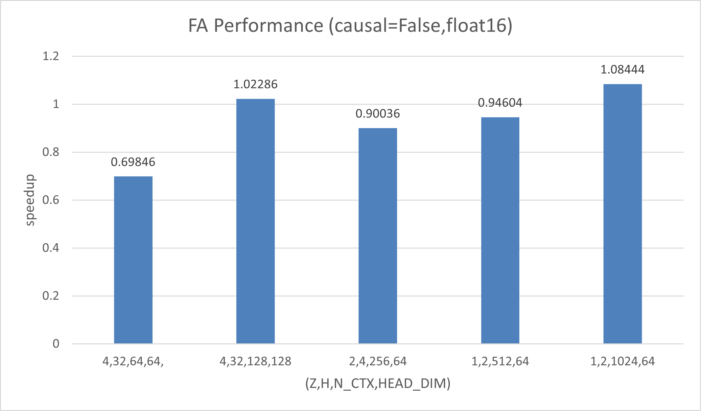
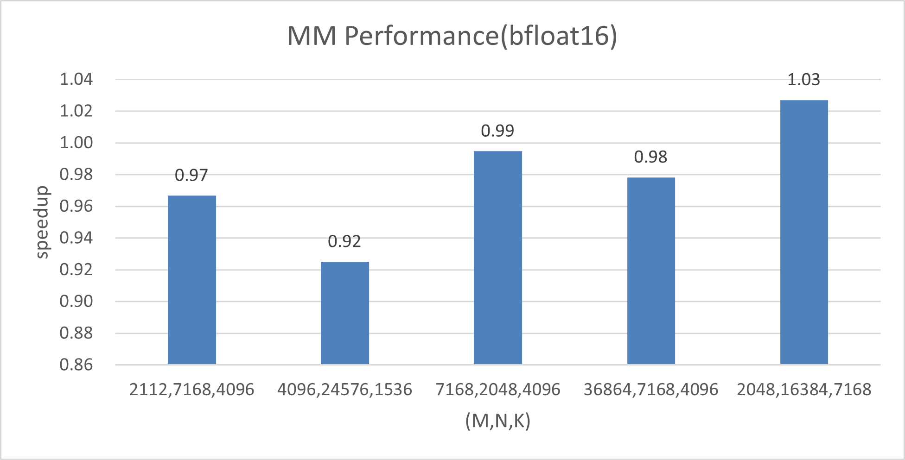

# Triton-Ascend

## Project Overview and Value Proposition
Triton-Ascend is a Triton compilation framework built for the Ascend platform, aiming to enable Triton code to run efficiently on Ascend hardware.
- #### Core Value
Triton is a Python-based compilation framework that has been favored by developers in recent years. Developers only need to focus on the tile/block slicing mode and the computation logic based on tiles/blocks. During the compilation of Triton code, the compiler automatically completes memory allocation, data transfer, data computation, and pipeline parallelism based on the characteristics of underlying hardware. This greatly reduces the operator development difficulty and significantly improves the development efficiency. 
Triton-Ascend adapts the Triton compilation stack to Huawei Ascend NPUs and provides a series of optimizations based on Triton, so that Triton code can run efficiently on Ascend hardware after compilation. 
Currently, Triton-Ascend is still being improved. We will continuously improve the completeness of Triton Python APIs, support more data types, make memory access more flexible, and continuously optimize the automatic optimization capability of the compiler to improve the overall functionality and performance generalization of Triton-Ascend.
- #### Ascend Ecosystem Positioning
The Triton-Ascend compilation framework removes the barriers between Triton and Ascend hardware, enabling developers who are familiar with the Triton framework to use Ascend NPUs more efficiently. It provides a universal and efficient operator development paradigm, which is a key part of agile development for the Ascend software stack. This greatly enriches the Ascend operator library and upper-layer application ecosystem.

## Latest Updates and Milestones
- #### Latest Updates
Current version: [Triton-Ascend 3.2.0](https://pypi.org/project/triton-ascend/) 
CANN version: [Ascend CANN Community Edition 8.5.0](https://www.hiascend.com/developer/download/community/result?module=cann&cann=8.5.0) 
Version plan for 2026: Upgrade to Triton 3.4.
- #### Milestones
| Milestone| Important Update| Status|
|------|------|------|
| 2025.11.14 | The pre-release version Triton-Ascend 3.2.0rc4 is available. [Extended the tt.fp_to_fp API to support conversion to the FP8 type.](https://gitcode.com/Ascend/triton-ascend/pull/891) [Added the scatter_ub_to_out API to support efficient data scattering from the UB to the GM.](https://gitcode.com/Ascend/triton-ascend/pull/864)| ✅ |
| 2025.09.30 | Improved the Triton Python APIs of the Scan/Sort class, supported non-contiguous memory access, and completed the adaptation of key Triton operators in the vLLM and sglang open-source repositories.| ✅ |
| 2025.09.19 | Supported the extraction of the Triton-Ascend [nightly package](https://test.pypi.org/project/triton-ascend/#history). | ✅ |
| 2025.08.15 | Improved the support for the Triton Python APIs of the Atomic class, completed the adaptation of key Triton operators in the Flaggems open-source repository, and provided reference cases for high-performance implementation of simple operators such as Matmul.| ✅ |
| 2025.06.30 | Supported 85% of Triton Python APIs and contiguous memory access, covering basic application scenarios.| ✅ |
| 2025.05.20 | Triton-Ascend is open-source, and the GitCode code repository is alive!| ✅ |
- #### Community Activities
1. [Meeting calendar](https://meeting.osinfra.cn/ascend)
2. [Meeting minutes dashboard](https://etherpad-ascend.meeting.osinfra.cn/p/sig-AscendNPU-IR)

## Performance Benchmarking
### Performance Charts of Key Operators
The key operators FA, MM, and Softmax that have been optimized are selected as examples. The following charts show the performance differences between Triton operators and AscendC operators. The metric is the speedup ratio (`Speedup = AscendC_Duration_Time/Triton_Duration_Time`). For details, see the [Optimization Guide](./docs/en/debug_guide/profiling.md).

- FA performance chart:

- MM performance chart:

- Softmax performance chart:

## Support

- #### Hardware Support
Triton-Ascend is supported by Ascend AI products. The following table lists the product models.

| Product Series                  | Product Model                             |
|----------------------------|---------------------------------------|
| **Atlas A3 training products**  | Atlas 800T A3 SuperNode server           |
|                            | Atlas 900 A3 SuperPoD server         |
|                            | A200T A3 Box8 SuperPoD server           |
| **Atlas A3 inference products**  | Atlas 800I A3 SuperNode server           |
| **Atlas A2 training products**  | Atlas 800T A2 training server             |
|                            | Atlas 900 A2 PoD cluster basic unit        |
|                            | Atlas 200T A2 Box16 heterogeneous subrack         |
| **Atlas A2 inference products**  | Atlas 800I A2 inference server             |
|                            | Atlas 300I A2 inference card                 |
|                            | A200I A2 Box heterogeneous subrack                |

- #### Compatibility

**Supported OSs:**
The OSs supported by Triton-Ascend are the same as those supported by CANN. Download and install the CANN version that is compatible with your OS. For details, see the official CANN documentation.

**CANN versions:**

- Commercial versions

| Triton-Ascend Version| CANN Commercial Version| Release Date|
|-------------------|----------------------|--------------------|
| 3.2.0             | CANN 8.5.0           | 2026/01/16         |
| 3.2.0rc4          | CANN 8.3.RC2         | 2025/11/20         |
|                   | CANN 8.3.RC1         | 2025/10/30         |

- Community versions

| Triton-Ascend Version| CANN Community Version| Release Date|
|-------------------|----------------------|--------------------|
| 3.2.0             | CANN 8.5.0           | 2026/01/16         |
| 3.2.0rc4          | CANN 8.3.RC2         | 2025/11/20         |
|                   | CANN 8.5.0.alpha001  | 2025/11/12         |
|                   | CANN 8.3.RC1         | 2025/10/30         |

## Getting Started

- [Quick Start](./docs/en/quick_start.md)

- [Architecture Design and Core Features](./docs/en/architecture_design_and_core_features.md)

- [Operator Development Guide](./docs/en/programming_guide.md)

- [Operator Migration Guide](./docs/en/migration_guide/migrate_from_gpu.md)

- [Operator Debugging Guide](./docs/en/debug_guide/debugging.md#)

- [Performance Optimization Guide](./docs/en/debug_guide/profiling.md#)

- [Environment Variables](docs/en/environment_variable_reference.md)

## FAQ

For details about the FAQ encountered when using Triton-Ascend, see [FAQ](./docs/en/FAQ.md#).

## Security Note

We attach great importance to the information security of developers using Triton-Ascend. For details about the security protection suggestions and related information, see [Security Note](./SECURITYNOTE.md).

## License Information
The code and documents of this project are released under the [MIT License](./LICENSE).

## Community and Contribution
You are welcome to participate in the development and code contribution of Triton-Ascend. For details, see [Contribution Guide](./CONTRIBUTING.zh.md).
