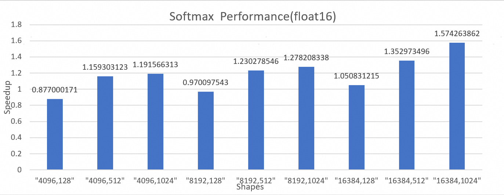

# Triton-Ascend

## 项目简介与价值主张
Triton-Ascend是面向昇腾平台构建的Triton编译框架，旨在让Triton代码能够在昇腾硬件上高效运行。
- #### 核心价值说明
Triton是近几年来受到开发者青睐的Python化编译框架。开发者仅需关注Tile/Block的切分方式以及基于Tile/Block的运算逻辑，编译器将在Triton代码的编译过程中结合底层硬件特点自动完成内存分配、数据搬运、数据计算、流水并行等，因此，算子的开发难度大幅降低、开发效率显著提升。  
Triton-Ascend将Triton编译栈适配到华为昇腾NPU上，在Triton的基础上提供一系列针对性的优化，使Triton代码能够编译后在昇腾硬件上高效运行。  
目前，Triton-Ascend仍在持续完善中，我们将不断提升Triton Python API完备度、数据类型支持度、访存方式灵活性等，并持续优化编译器的自动优化能力，提升Triton-Ascend整体的功能与性能泛化性。
- #### 昇腾生态定位
Triton-Ascend编译框架打通了Triton与昇腾硬件之间的壁垒，使熟悉Triton框架的开发者可以更有效率地使用昇腾NPU。它通过提供通用、高效的算子开发范式，为昇腾软件栈补齐了敏捷开发的关键一环，极大丰富了昇腾的算子库和上层应用生态。

## 最新动态与里程碑
- #### 近期版本更新
当前版本：[Triton-Ascend 3.2.0RC4](https://pypi.org/project/triton-ascend/)  
配套CANN版本：[昇腾CANN社区版8.3.RC2](https://www.hiascend.com/developer/download/community/result?module=cann&cann=8.3.RC2)  
2026年版本计划：升级triton版本到triton3.4
- #### 里程碑
| 里程碑 | 重要特性更新情况 | 状态 |
|------|------|------|
| 2025.11.14 | Triton-Ascend 3.2.0rc4预发布版本上线： [扩展 tt.fp_to_fp 接口，新增对 FP8的类型转换支持](https://gitcode.com/Ascend/triton-ascend/pull/891)  [新增 scatter_ub_to_out 接口，支持从UB到GM的高效数据分散操作](https://gitcode.com/Ascend/triton-ascend/pull/864)| ✅ |
| 2025.09.30 | 完善Scan/Sort类Triton Python API，支持非连续访存，完成vLLM、sglang开源仓中重点Triton算子适配 | ✅ |
| 2025.09.19 | 支持Triton-Ascend [nightly包](https://test.pypi.org/project/triton-ascend/#history)提取  | ✅ |
| 2025.08.15 | 完善Atomic类Triton Python API支持，完成Flaggems开源仓重点Triton算子适配，提供Matmul等简单算子高性能实现参考用例 | ✅ |
| 2025.06.30 | 支持85% Triton Python API，支持连续访存，覆盖基本使用场景需求 | ✅ |
| 2025.05.20 | Triton-Ascend开源，Gitcode代码仓Alive！ | ✅ |
- #### 社区活动信息
1. [会议日历](https://meeting.osinfra.cn/ascend)
2. [会议纪要看板]( https://etherpad-ascend.meeting.osinfra.cn/p/sig-AscendNPU-IR)

## 性能基准测试
### 关键算子性能图表
选取经过性能优化后的关键算子FA、MM、Softmax作为示例。通过图表展示Triton算子与AscendC算子的性能差异，指标为加速比(`Speedup= AscendC_Duration_Time / Triton_Duration_Time`), [调优指南参考方法](./docs/zh/debug_guide/profiling.md)：

- FA 性能图表：

- MM 性能图表：

- Softmax 性能图表：

## 支持范围

- #### 硬件支持
Triton-Ascend 在昇腾 AI 产品支持使用，具体型号如下：

| 产品系列                   | 产品型号                              |
|----------------------------|---------------------------------------|
| **Atlas A3 训练系列产品**   | Atlas 800T A3 超节点服务器            |
|                            | Atlas 900 A3 SuperPoD 超节点          |
|                            | A200T A3 Box8 超节点服务器            |
| **Atlas A3 推理系列产品**   | Atlas 800I A3 超节点服务器            |
| **Atlas A2 训练系列产品**   | Atlas 800T A2 训练服务器              |
|                            | Atlas 900 A2 PoD 集群基础单元         |
|                            | Atlas 200T A2 Box16 异构子框          |
| **Atlas A2 推理系列产品**   | Atlas 800I A2 推理服务器              |
|                            | Atlas 300I A2 推理卡                  |
|                            | A200I A2 Box 异构组件                 |

- #### 兼容性

**支持操作系统：**
Triton-Ascend 跟随 CANN 支持的操作系统，请根据CANN文档，下载并安装对应操作系统的CANN版本。

**CANN版本：**

- 商用版

| 版本                     | 发布日期   | 适配Triton-Ascend版本   |
|--------------------------|------------|------------|
| 昇腾CANN商用版 8.3.RC2   | 2025/11/20 | triton-ascend 3.2.0rc4 |
| 昇腾CANN商用版 8.3.RC1   | 2025/10/30 | triton-ascend 3.2.0rc4 |

- 社区版

| 版本                              | 发布日期   | 适配Triton-Ascend版本   |
|-----------------------------------|------------|------------|
| 昇腾CANN社区版 8.3.RC2            | 2025/11/20 | triton-ascend 3.2.0rc4 |
| 昇腾CANN社区版 8.5.0.alpha001     | 2025/11/12 | triton-ascend 3.2.0rc4 |
| 昇腾CANN社区版 8.3.RC1            | 2025/10/30 | triton-ascend 3.2.0rc4 |

## 入门指引

- [快速开始](./docs/zh/quick_start.md)

- [架构设计与核心特性](./docs/zh/architecture_design_and_core_features.md)

- [算子开发指南](./docs/zh/programming_guide.md)

- [算子迁移指南](./docs/zh/migration_guide/migrate_from_gpu.md)

- [算子调试指南](./docs/zh/debug_guide/debugging.md#)

- [性能调优指南](./docs/zh/debug_guide/profiling.md#)

- [环境变量](docs/zh/environment_variable_reference.md)

## 常见问题

在使用Triton-Ascend时遇到的常见问题，详见 [FAQ](./docs/zh/FAQ.md#)

## 安全声明

我们重视开发者在使用Triton-Ascend时的信息安全，安全防护建议与相关信息请见 [安全声明](./SECURITYNOTE.md)

## 许可证信息
本项目代码与文档均采用 [MIT许可证](./LICENSE)

## 社区与贡献
欢迎参与Triton-Ascend的开发及代码贡献，详情请参阅 [贡献指南](./CONTRIBUTING.zh.md)