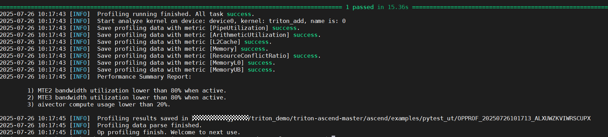
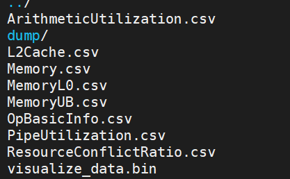
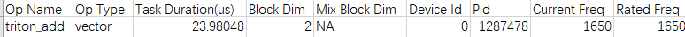
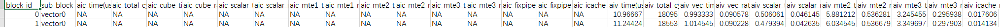
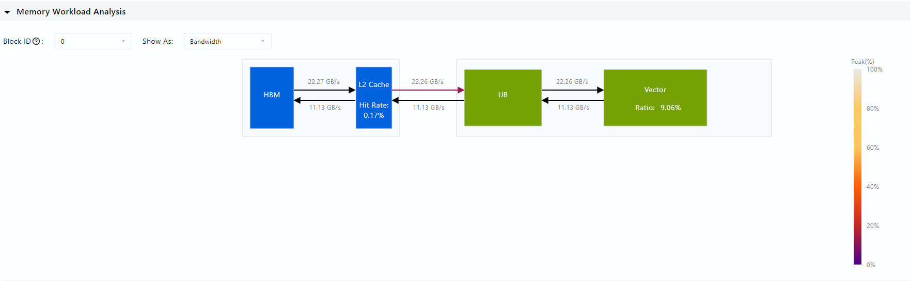
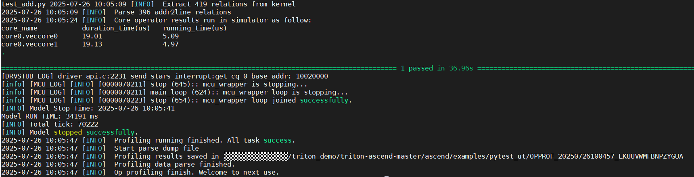
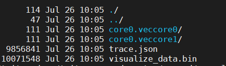
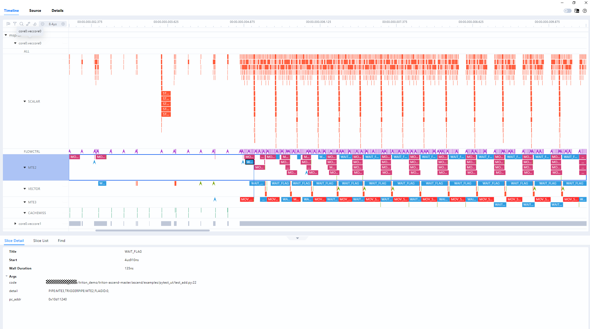
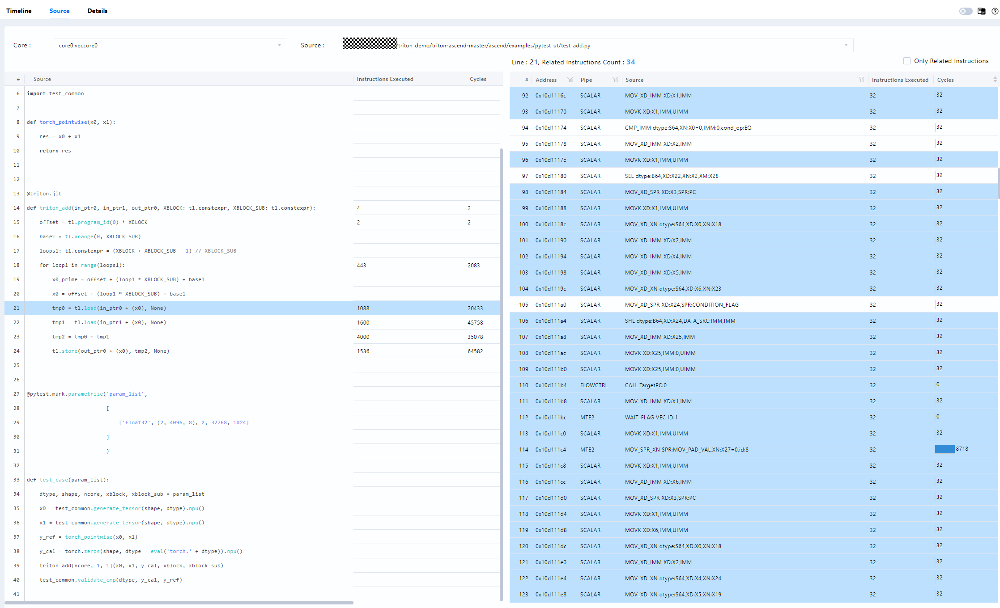

# msProf op 性能调优

msProf工具用于采集和分析运行在昇腾AI处理器上算子的关键性能指标，用户可根据输出的性能数据，快速定位算子的软、硬件性能瓶颈，提升算子性能的分析效率。已支持Triton算子性能数据采集、仿真流水图生成等，本节中，将展示算子性能调优工具在triton算子开发过程中的应用。

## 1.环境准备

工具使用前，需完成环境准备，详细参考[README.md](../getting-started/installation.md), 配置triton环境
其他配置：
  - 编译选项指定  
    对于算子仿真场景，如需要增加-g信息获取代码行调用栈信息的情况，需要通过设置如下环境变量来使能算子代码热点图和代码调用栈功能
    export TRITON_DISABLE_LINE_INFO=0
  - 仿真环境变量
    进行算子仿真前，需设置需指定算子仿真芯片类型。

使用资料参考：使用资料可参考：[《算子开发工具-算子调优》](https://www.hiascend.com/document/detail/zh/CANNCommunityEdition/82RC1alpha003/devaids/optool/atlasopdev_16_0082.html)

## 2.算子调优

msProf工具包含msprof op（上板）和msprof op simulator（仿真）两种使用方式，协助用户定位算子内存、算子代码以及算子指令的异常，实现全方位的算子调优。

功能简介：
| 功能名称 | 适用场景       | 展示的图形                      |
|----------|------------------|----------------------------------|
| msprof op   | 适用于实际运行环境中的性能分析   | 计算内存热力图、Roofline瓶颈分析图、Cache热力图、通算流水图、算子代码热点图  |
| msprof op simulator  | 适用于开发和调试阶段，进行详细仿真调优 | 指令流水图、算子代码热点图、内存通路吞吐率波形图 |

本文以add算子为例，介绍如何在各场景中使用msprof op算子性能调优工具。

### 2.1 算子代码样例

add算子实代码如下：
```Python
import triton
import triton.language as tl
import numpy as np
import torch
import pytest
import test_common

def torch_pointwise(x0, x1):
    res = x0 + x1
    return res


@triton.jit
def triton_add(in_ptr0, in_ptr1, out_ptr0, XBLOCK: tl.constexpr, XBLOCK_SUB: tl.constexpr):
    offset = tl.program_id(0) * XBLOCK
    base1 = tl.arange(0, XBLOCK_SUB)
    loops1: tl.constexpr = (XBLOCK + XBLOCK_SUB - 1) // XBLOCK_SUB
    for loop1 in range(loops1):
        x0_prime = offset + (loop1 * XBLOCK_SUB) + base1
        x0 = offset + (loop1 * XBLOCK_SUB) + base1
        tmp0 = tl.load(in_ptr0 + (x0), None)
        tmp1 = tl.load(in_ptr1 + (x0), None)
        tmp2 = tmp0 + tmp1
        tl.store(out_ptr0 + (x0), tmp2, None)


@pytest.mark.parametrize('param_list',
                         [
                             ['float32', (2, 4096, 8), 2, 32768, 1024]
                         ]
                         )

def test_case(param_list):
    dtype, shape, ncore, xblock, xblock_sub = param_list
    x0 = test_common.generate_tensor(shape, dtype).npu()
    x1 = test_common.generate_tensor(shape, dtype).npu()
    y_ref = torch_pointwise(x0, x1)
    y_cal = torch.zeros(shape, dtype = eval('torch.' + dtype)).npu()
    triton_add[ncore, 1, 1](x0, x1, y_cal, xblock, xblock_sub)
    test_common.validate_cmp(dtype, y_cal, y_ref)
```

### 2.2 算子上板调优

算子上板信息采集，参考命令
```
msprof op --kernel-name=triton_add pytest test_add.py
```
说明： 更多特性可参考官方资料[《算子开发工具-算子调优》](https://www.hiascend.com/document/detail/zh/CANNCommunityEdition/82RC1alpha003/devaids/optool/atlasopdev_16_0082.html)


执行结果：



落盘数据：  
  
落盘性能指标数据详细说明，可参考msprof op 资料查看，参考链接：[《算子开发工具-算子调优》](https://www.hiascend.com/document/detail/zh/CANNCommunityEdition/82RC1alpha003/devaids/optool/atlasopdev_16_0082.html)


算子基础信息：  

  

算子block Pipe信息：  
  


insight信息展示(Memory)：  
  


### 2.3.算子仿真调优

算子仿真信息采集，参考命令:  
```
msprof op simulator --kernel-name=triton_add --soc-version=Ascend910B1  pytest test_add.py
```
说明： 更多特性可参考官方资料[《算子开发工具-算子调优》](https://www.hiascend.com/document/detail/zh/CANNCommunityEdition/82RC1alpha003/devaids/optool/atlasopdev_16_0082.html)


执行结果：  
  


落盘数据：  
  


仿真流水图：  
  


代码热点图：  



其他使用说明：
  - msProf工具的使用依赖CANN包中的msopprof可执行文件，该文件中的接口使用和msprof op一致，该文件为CANN包自带，无需单独安装。
  - 不支持在同一个Device侧同时拉起多个性能采集任务。
  - 使用msprof op和msprof op simulator之前，用户需保证app功能正常。
  - 当前暂不支持--aic-metrics=TimeLineDetail、kernelScale
