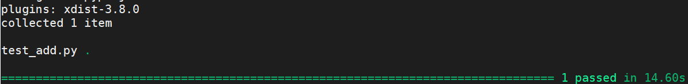
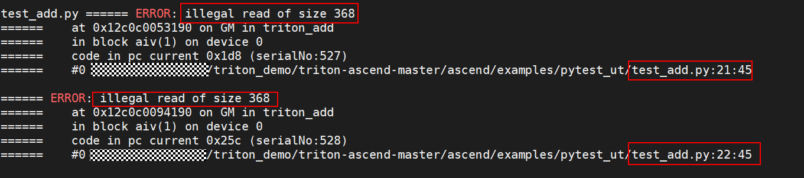
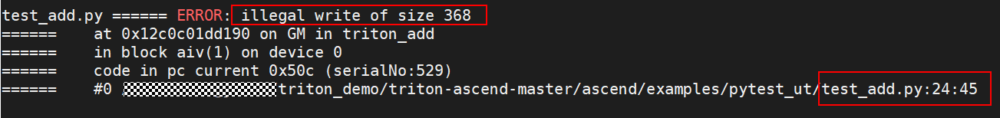
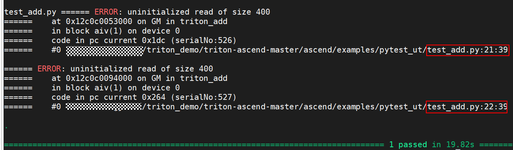

# msSanitizer 异常检测

msSanitizer工具是基于昇腾AI处理器的一个异常检测工具，包含了内存检测、竞争检测和未初始化检测三个子功能，已支持Triton算子异常行为检测，本节中，我们将介绍如何零开始在 triton 算子中使用 msSanitizer 进行检测。

## 1.环境准备

工具使用前，需完成环境准备，详细参考[Readme.MD](../getting-started/installation.md), 配置triton环境
其他配置：
  - 关闭内存池  
    Triton场景会使用PyTorch创建Tensor，PyTorch框架内默认使用内存池的方式管理GM内存，会对内存检测产生干扰。因此，在检测前需要额外设置如下环境变量关闭内存池，以保证检测结果准确。  
    export PYTORCH_NO_NPU_MEMORY_CACHING=1
  - 清空缓存  
    避免算子未重新编译影响，建议开启环境变量：export TRITON_ALWAYS_COMPILE=1
  - 配置静态插桩环境变量
    Triton算子采用Python语言进行开发，并且采用即时编译（JIT）方式来编译算子Kernel。在执行算子脚本前，需要配置以下环境变量支持全量检测。  
    export TRITON_ENABLE_SANITIZER=1  
使用资料参考：使用资料可参考：[《算子开发工具-异常检测》](https://www.hiascend.com/document/detail/zh/mindstudio/80RC1/ODtools/Operatordevelopmenttools/atlasopdev_16_0039.html)


## 2.算子异常检测
    
msSanitizer通过不同子功能提供了不同类型的异常检测功能，功能简介如下：
| 功能名称 | 适用场景       | 功能说明                      |
|----------|------------------|----------------------------------|
| memcheck   | 内存检测   | 工具可以在用户开发算子的过程中，协助定位非法读写、多核踩踏、非对齐访问、内存泄漏以及非法释放等内存问题。同时工具也支持对CANN软件栈的内存检测，帮助用户定界软件栈内存异常发生的模块  |
| initcheck  | 竞争检测 | 工具可以协助用户定位由于竞争风险可能导致的数据竞争问题，包含核内竞争和核间竞争问题。其中，核内竞争包含流水间竞争和流水内竞争 |
| racecheck  | 未初始化检测 | 工具可以协助用户定位由于内存未初始化可能导致的脏数据读取问题 |

本文以add算子为例，介绍如何在各场景中使用msSanitizer检测工具。

### 2.1 算子代码样例

add算子样例代码如下：
```Python
import triton
import triton.language as tl
import numpy as np
import torch
import pytest
import test_common

def torch_pointwise(x0, x1):
    res = x0 + x1
    return res


@triton.jit
def triton_add(in_ptr0, in_ptr1, out_ptr0, XBLOCK: tl.constexpr, XBLOCK_SUB: tl.constexpr):
    offset = tl.program_id(0) * XBLOCK
    base1 = tl.arange(0, XBLOCK_SUB)
    loops1: tl.constexpr = (XBLOCK + XBLOCK_SUB - 1) // XBLOCK_SUB
    for loop1 in range(loops1):
        x0_prime = offset + (loop1 * XBLOCK_SUB) + base1
        x0 = offset + (loop1 * XBLOCK_SUB) + base1
        tmp0 = tl.load(in_ptr0 + (x0), None)
        tmp1 = tl.load(in_ptr1 + (x0), None)
        tmp2 = tmp0 + tmp1
        tl.store(out_ptr0 + (x0), tmp2, None)


@pytest.mark.parametrize('param_list',
                         [
                             ['float32', (2, 4096, 8), 2, 32768, 1024]
                         ]
                         )

def test_case(param_list):
    dtype, shape, ncore, xblock, xblock_sub = param_list
    x0 = test_common.generate_tensor(shape, dtype).npu()
    x1 = test_common.generate_tensor(shape, dtype).npu()
    y_ref = torch_pointwise(x0, x1)
    y_cal = torch.zeros(shape, dtype = eval('torch.' + dtype)).npu()
    triton_add[ncore, 1, 1](x0, x1, y_cal, xblock, xblock_sub)
    test_common.validate_cmp(dtype, y_cal, y_ref)
```


执行结果：


### 2.2 异常用例检测
在此，分别构造内存异常读写、未初始化功能异常用例，基于检测工具拉起，查看异常信息检测结果。

#### 2.2.1 内存异常

内存检测是针对用户程序运行时的一种异常检测，该工具可以检测并报告算子运行中对外部存储（Global Memory）和内部存储（Local Memory）的越界及未对齐等内存访问异常。


参考构造内存非法读、写异常用例如下：
  - 非法读用例
    ```Python
    @triton.jit
    def triton_add(in_ptr0, in_ptr1, out_ptr0, XBLOCK: tl.constexpr, XBLOCK_SUB: tl.constexpr):
        offset = tl.program_id(0) * XBLOCK
        base1 = tl.arange(0, XBLOCK_SUB)
        loops1: tl.constexpr = (XBLOCK + XBLOCK_SUB - 1) // XBLOCK_SUB
        for loop1 in range(loops1):
            x0_prime = offset + (loop1 * XBLOCK_SUB) + base1
            x0 = offset + (loop1 * XBLOCK_SUB) + base1
            tmp0 = tl.load(in_ptr0 + (x0) + 100, None)
            tmp1 = tl.load(in_ptr1 + (x0) + 100, None)
            tmp2 = tmp0 + tmp1
            tl.store(out_ptr0 + (x0), tmp2, None)
    
    ```
  - 非法写用例
    ```Python
    @triton.jit
    def triton_add(in_ptr0, in_ptr1, out_ptr0, XBLOCK: tl.constexpr, XBLOCK_SUB: tl.constexpr):
        offset = tl.program_id(0) * XBLOCK
        base1 = tl.arange(0, XBLOCK_SUB)
        loops1: tl.constexpr = (XBLOCK + XBLOCK_SUB - 1) // XBLOCK_SUB
        for loop1 in range(loops1):
            x0_prime = offset + (loop1 * XBLOCK_SUB) + base1
            x0 = offset + (loop1 * XBLOCK_SUB) + base1
            tmp0 = tl.load(in_ptr0 + (x0), None)
            tmp1 = tl.load(in_ptr1 + (x0), None)
            tmp2 = tmp0 + tmp1
            tl.store(out_ptr0 + (x0) + 100, tmp2, None)
    
    ```

检测工具拉起异常用例：
参考命令：
```
msssanitizer -t memcheck pytest test_add.py
```

非法读检测结果:


非法写检测结果：
  

通过结果扫描打屏日志可分析，异常读、写行为均可定位异常大小、代码行信息，便于开发者快速完成问题定位。

#### 2.2.2 未初始化异常

未初始化异常，内存申请后为未初始化状态，未对内存进行写入，直接读取未初始化的值导致的异常。参考构造未初始化异常用例，参考代码如下：
    
    ```Python
    @triton.jit
    def triton_add(in_ptr0, in_ptr1, out_ptr0, XBLOCK: tl.constexpr, XBLOCK_SUB: tl.constexpr):
        offset = tl.program_id(0) * XBLOCK
        base1 = tl.arange(0, XBLOCK_SUB + 100)
        loops1: tl.constexpr = (XBLOCK + XBLOCK_SUB - 1) // XBLOCK_SUB
        for loop1 in range(loops1):
            x0_prime = offset + (loop1 * XBLOCK_SUB) + base1
            x0 = offset + (loop1 * XBLOCK_SUB) + base1
            tmp0 = tl.load(in_ptr0 + (x0), None)
            tmp1 = tl.load(in_ptr1 + (x0), None)
            tmp2 = tmp0 + tmp1
            tl.store(out_ptr0 + (x0), tmp2, None)
    ```
参考命令：
```
mssanitizer -t initcheck  pytest test_add.py
``` 

未初始化检测结果：

通过检测扫描结果，用户可快速基于代码行定位未初始化问题，提高问题定位效率。

#### 2.2.3 其他说明

异常报告具有以下级别：
 - WARNING：此级别被定义为不确定性的风险，可能出现的异常现象由实际情况决定，如多核踩踏、内存分配未使用等。其中，多核踩踏风险涉及多个核对同一块内存的操作，高阶用户可以通过核间同步的手段来规避此风险，初阶用户遇到此类异常，应该将其视为危险源。目前，多核踩踏的WARNING级别的报告仅能识别atomic类的核间同步信息。

 - ERROR：最高严重级别的异常，涉及针对内存操作的确定性错误，如非法读写、内存泄漏、非对齐访问、内存未初始化、竞争异常等。强烈建议用户检查此严重级别的异常。